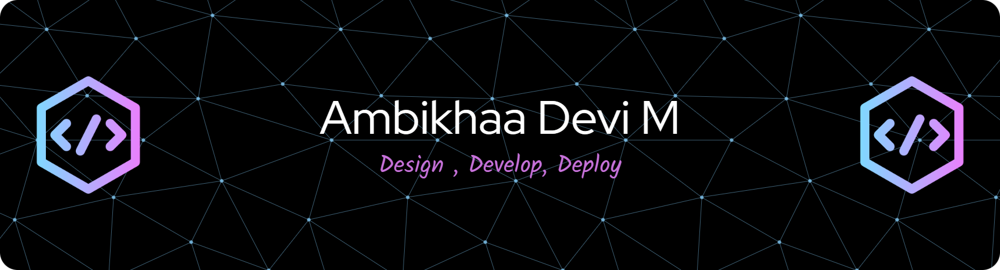

<!-- Centered Animated Banner -->

  

<!-- Gradient Heading with Waving Hand -->
<h1 align="center">
  
    Hi   I'm Ambikhaa Devi
  
</h1>
<h3 align="center">💻 Software Engineer | 🚀 AI • Web Development • Data Science</h3>

<!-- Typing Animation -->

  

<!-- Social Badges -->

  
  
  
  

---

## 🏷 About Me
🚀 Passionate **Software Engineer** with a Master’s in Computer Science and strong expertise in **AI, Web Development, and Data Science**.  
💡 Experienced in building **production-ready applications**, optimizing **front-end performance**, and creating **end-to-end ML pipelines**.  
📌 Currently **open to work** and collaborations on innovative projects that create real-world impact.

---

## 🏆 Achievements & Badges

  
  

---

## 🛠 Skills

### 💻 Programming Languages

  <picture>
    <source media="(prefers-color-scheme: dark)" srcset="https://raw.githubusercontent.com/devicons/devicon/master/icons/python/python-original.svg" />
    <source media="(prefers-color-scheme: light)" srcset="https://raw.githubusercontent.com/devicons/devicon/master/icons/python/python-original.svg" />
    
  </picture>

  <picture>
    <source media="(prefers-color-scheme: dark)" srcset="https://raw.githubusercontent.com/devicons/devicon/master/icons/html5/html5-original.svg" />
    <source media="(prefers-color-scheme: light)" srcset="https://raw.githubusercontent.com/devicons/devicon/master/icons/html5/html5-original.svg" />
    
  </picture>

  <picture>
    <source media="(prefers-color-scheme: dark)" srcset="https://raw.githubusercontent.com/devicons/devicon/master/icons/css3/css3-original.svg" />
    <source media="(prefers-color-scheme: light)" srcset="https://raw.githubusercontent.com/devicons/devicon/master/icons/css3/css3-original.svg" />
    
  </picture>

  <picture>
    <source media="(prefers-color-scheme: dark)" srcset="https://raw.githubusercontent.com/devicons/devicon/master/icons/javascript/javascript-original.svg" />
    <source media="(prefers-color-scheme: light)" srcset="https://raw.githubusercontent.com/devicons/devicon/master/icons/javascript/javascript-original.svg" />
    
  </picture>

### 📚 Libraries & Frameworks

  <picture>
    <source media="(prefers-color-scheme: dark)" srcset="https://raw.githubusercontent.com/devicons/devicon/master/icons/react/react-original.svg" />
    <source media="(prefers-color-scheme: light)" srcset="https://raw.githubusercontent.com/devicons/devicon/master/icons/react/react-original.svg" />
    
  </picture>

  <picture>
    <source media="(prefers-color-scheme: dark)" srcset="https://raw.githubusercontent.com/devicons/devicon/master/icons/bootstrap/bootstrap-original.svg" />
    <source media="(prefers-color-scheme: light)" srcset="https://raw.githubusercontent.com/devicons/devicon/master/icons/bootstrap/bootstrap-original.svg" />
    
  </picture>

  <!-- Pandas -->
  <picture>
    <source media="(prefers-color-scheme: dark)" srcset="https://raw.githubusercontent.com/devicons/devicon/master/icons/pandas/pandas-original.svg" />
    <source media="(prefers-color-scheme: light)" srcset="https://raw.githubusercontent.com/devicons/devicon/master/icons/pandas/pandas-original.svg" />
    
  </picture>

  <!-- NumPy -->
  <picture>
    <source media="(prefers-color-scheme: dark)" srcset="https://raw.githubusercontent.com/devicons/devicon/master/icons/numpy/numpy-original.svg" />
    <source media="(prefers-color-scheme: light)" srcset="https://raw.githubusercontent.com/devicons/devicon/master/icons/numpy/numpy-original.svg" />
    
  </picture>

  <!-- Matplotlib -->
  <picture>
    <source media="(prefers-color-scheme: dark)" srcset="https://raw.githubusercontent.com/valohai/ml-logos/master/matplotlib.svg" />
    <source media="(prefers-color-scheme: light)" srcset="https://raw.githubusercontent.com/valohai/ml-logos/master/matplotlib.svg" />
    
  </picture>

  <picture>
    <source media="(prefers-color-scheme: dark)" srcset="https://raw.githubusercontent.com/devicons/devicon/master/icons/tensorflow/tensorflow-original.svg" />
    <source media="(prefers-color-scheme: light)" srcset="https://raw.githubusercontent.com/devicons/devicon/master/icons/tensorflow/tensorflow-original.svg" />
    
  </picture>

  <picture>
    <source media="(prefers-color-scheme: dark)" srcset="https://raw.githubusercontent.com/devicons/devicon/master/icons/keras/keras-original.svg" />
    <source media="(prefers-color-scheme: light)" srcset="https://raw.githubusercontent.com/devicons/devicon/master/icons/keras/keras-original.svg" />
    
  </picture>

### 🛠 Tools & Platforms

 <!-- GitHub -->

  <picture>
    <source media="(prefers-color-scheme: dark)" srcset="https://raw.githubusercontent.com/devicons/devicon/master/icons/vscode/vscode-original.svg" />
    <source media="(prefers-color-scheme: light)" srcset="https://raw.githubusercontent.com/devicons/devicon/master/icons/vscode/vscode-original.svg" />
    
  </picture>

  <picture>
    <source media="(prefers-color-scheme: dark)" srcset="https://raw.githubusercontent.com/devicons/devicon/master/icons/figma/figma-original.svg" />
    <source media="(prefers-color-scheme: light)" srcset="https://raw.githubusercontent.com/devicons/devicon/master/icons/figma/figma-original.svg" />
    
  </picture>

---

## 📌 Project Categories
- 🤖 AI & Machine Learning  
- 🌐 Web Development (Frontend & Full Stack)  
- 📊 Data Science & Visualization  
- 🛠 Automation & Tools  
- 📱 Responsive UI/UX Designs  

---

## 🎓 Certifications
1. **AI for All from Basics to Gen AI Practice** — NVIDIA  
2. **Intro to Generative AI** — Google Cloud Skills Boost  
3. **Data Science** — JSDC  
4. **LLM — Powered by Google Cloud** — Simplilearn  
5. **JavaScript & React Basics** — Simplilearn  
6. **HTML & CSS** — Great Learning  

---

## 📊 GitHub Stats

  
  
  

---

## 🌐 Connect with Me

  
  
  
  

---

<!-- Snake Animation (Light & Dark Mode) -->

  <picture>
    <source media="(prefers-color-scheme: dark)" srcset="https://raw.githubusercontent.com/Platane/snk/output/github-contribution-grid-snake-dark.svg" />
    <source media="(prefers-color-scheme: light)" srcset="https://raw.githubusercontent.com/Platane/snk/output/github-contribution-grid-snake.svg" />
    
  </picture>

---

*✨ "Turning ideas into reality, one line of code at a time." ✨*
